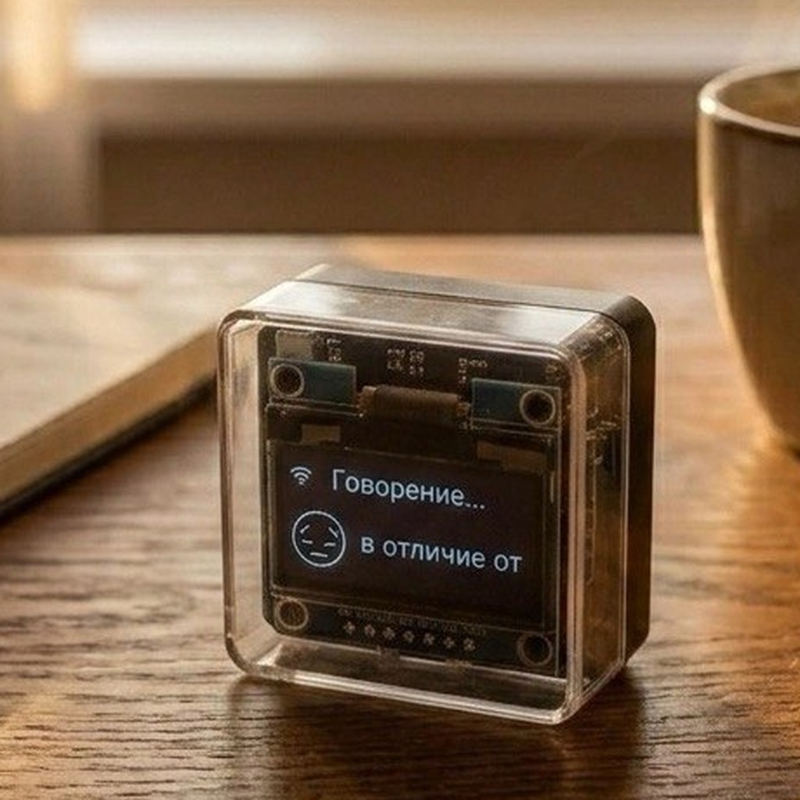
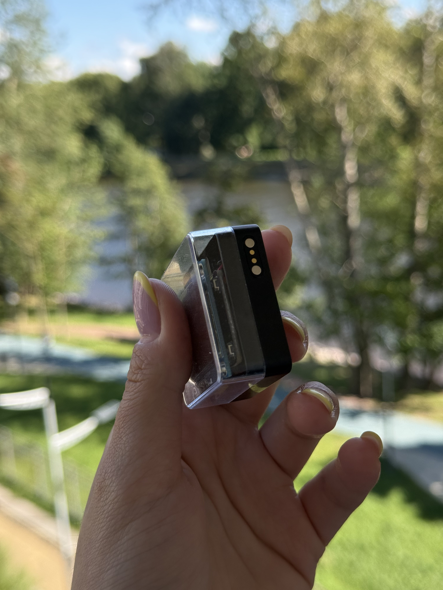
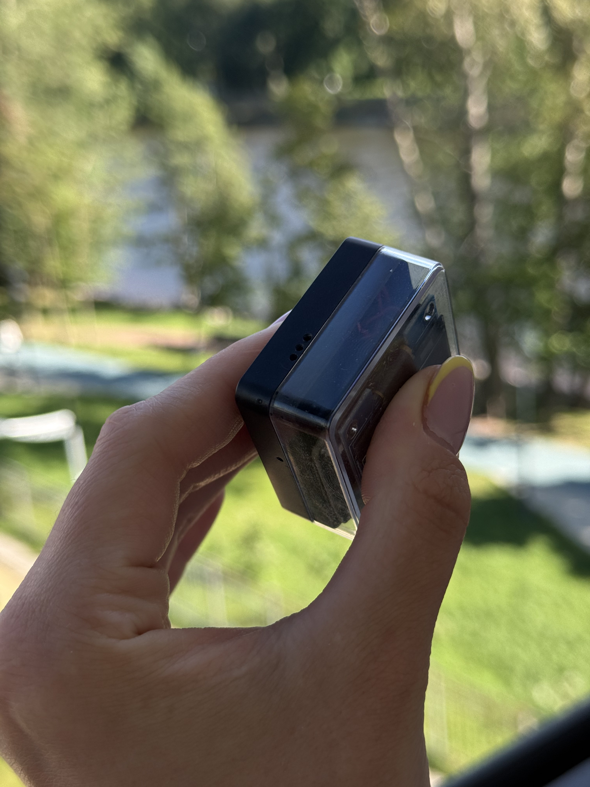
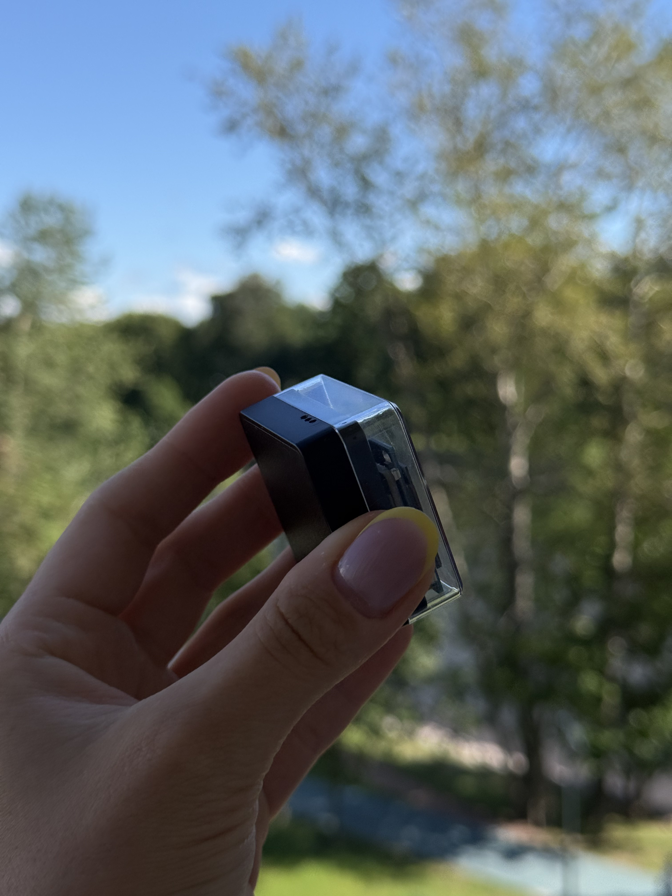

# Pocket AI Voice Assistant 3.0

A tiny companion from the future that lives on your desk.

BIPS is not just a gadget — it's a little friend you actually want to talk to. It reminds you to take a break, drink water, and step away from the screen. You speak, it responds. It searches the internet, remembers facts, and shows its mood on a tiny OLED screen. Put it on your desk and watch colleagues stop by, touch it, ask questions, and smile.

No subscriptions. No token limits. No "upgrade to premium" popups. Connects to Wi-Fi once and forgets about it. Remembers up to 10 networks, so you can take it outside on a mobile hotspot. Choose a voice, set a personality — make it yours.

The semi-transparent case is not just for looks. It's a statement: this is what AI looks like when it becomes something you can hold, turn around, and see how it works inside.



---

## What's New in v3.0

Compared to [v1](https://github.com/Vitalymt/Pocket-AI-Voice-Assistant) and [v2](https://github.com/Vitalymt/Pocket-AI-Voice-Assistant-2.0):

- **Bigger screen** — 1.3" SH1106 OLED (was 0.96" SSD1306)
- **Zero physical buttons** — capacitive touch button hidden inside the case, responds to touch through the plastic. Acts as both "speak" and "wake from sleep"
- **Magnetic charging** — pogo pins replace dual USB-C connectors. Like wireless earbuds: drop it on the charger and it charges
- **43x43mm body** — thinner, fewer holes (only the speaker opening)
- **Better speaker** — cleaner sound, louder voice output
- **Smart sleep** — screen off after 2 minutes, deep sleep after 5 minutes. Wakes on touch
- **Web search** — Tavily API, searches the internet and responds with voice
- **OTA updates** — firmware updates over the air, no cables needed

## Specs

- **Brain:** ESP32-S3 N16R8 (16MB flash, 8MB PSRAM)
- **Board:** XH-S3E-AI V1.0 (audio amplifier built-in)
- **Display:** SH1106 1.3" OLED, 128x64, I2C
- **Audio:** I2S, 16kHz, speaker + microphone
- **Body:** 43x43mm, thin, minimal openings
- **Button:** capacitive TTP223 inside the case (touch through plastic)
- **Charging:** magnetic via pogo pins
- **Battery:** LiPo
- **Wi-Fi:** 802.11 b/g/n
- **Language:** Russian

## Components

- **Board:** XH-S3E-AI V1.0 (ESP32-S3 N16R8 + built-in audio amplifier)
- **Display:** SH1106 1.3" OLED (I2C, 128x64)
- **Microphone:** INMP441 (I2S)
- **Button:** TTP223 (capacitive, inside the case)
- **Battery:** LiPo
- **Charging:** magnetic, pogo pins

## Pinout

```
Display SH1106:
  SDA  → GPIO41
  SCL  → GPIO42

Speaker (I2S, built into board):
  DOUT → GPIO7
  BCLK → GPIO15
  LRCK → GPIO16

Microphone INMP441:
  SCK  → GPIO5
  WS   → GPIO4
  DIN  → GPIO6

Touch button TTP223:
  SIG  → GPIO43

Volume buttons:
  VOL+ → GPIO40
  VOL- → GPIO39

LED: GPIO48
```

## How It Works

1. **Touch** — the device wakes up, shows eyes on the screen
2. **Speak** — the eyes become "listening", microphone records your voice
3. **Think** — speech goes to the cloud, AI processes it
4. **Respond** — the eyes "speak", the speaker plays the answer
5. **Silent for 2 minutes** — screen turns off
6. **Silent for 5 minutes** — deep sleep, wakes on touch

## Firmware

The firmware is based on [Xiaozhi ESP32](https://github.com/78/xiaozhi-esp32) — an open-source platform for building AI voice assistants on ESP32 hardware. Without Xiaozhi, the device would not function.


### OTA Updates

The device checks for updates on every boot:

```
Boot → downloads ota.json → compares version → if newer → updates
```

## Gallery



*BIPS v3 — fits in your palm, magnetic charging contacts visible*



*Speaker holes and matte black finish*



*Compact cube form factor, 43x43mm*

## Generations

- [v1](https://github.com/Vitalymt/Pocket-AI-Voice-Assistant) — first generation, 0.96" OLED, dual USB-C, physical toggle switch
- [v2](https://github.com/Vitalymt/Pocket-AI-Voice-Assistant-2.0) — transparent case, touch button, 4 LED battery indicator
- **v3** — you are here. 1.3" OLED, magnetic charging, zero physical buttons

## Links

- [Xiaozhi ESP32](https://github.com/78/xiaozhi-esp32) — base firmware (open-source)
- [ESP-IDF](https://github.com/espressif/esp-idf) — build framework

## Contact

- Telegram: [@hitdata](https://t.me/hitdata)

## License

Proprietary. All rights reserved.
